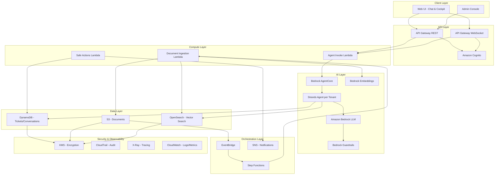
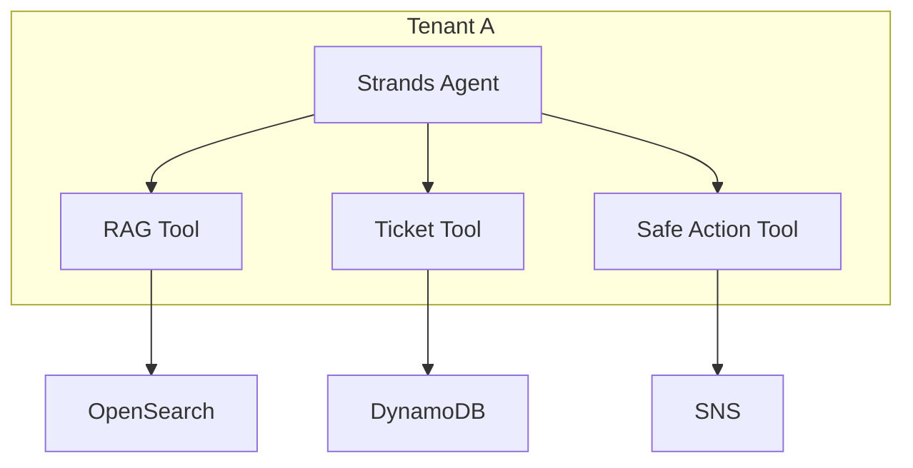
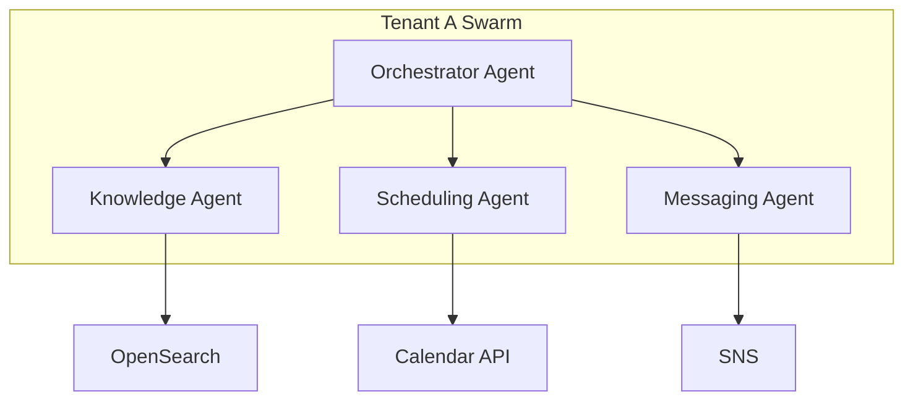
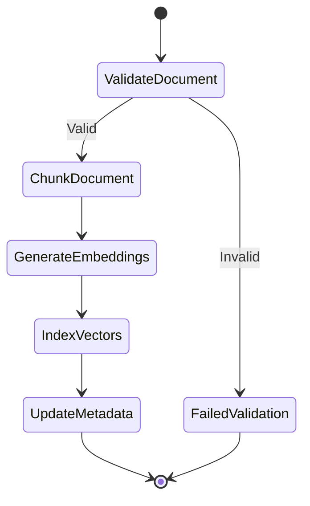
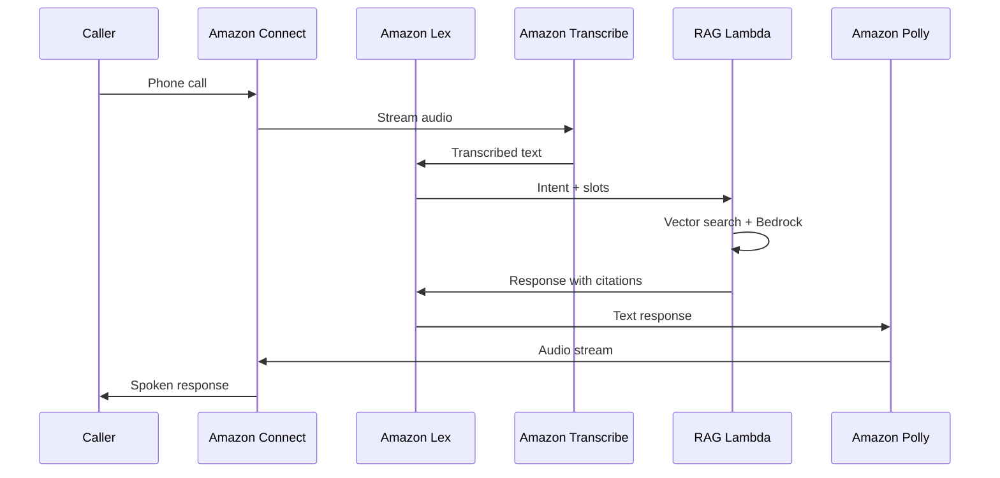

# FlowOps Infrastructure Design Document

## Overview

This document describes the AWS CDK infrastructure design for FlowOps, a chat-first AI-powered support operations platform. The infrastructure is organized as a monorepo containing CDK stacks, Lambda functions, and shared libraries. The design prioritizes modularity, tenant isolation, and operational excellence while supporting the core RAG-based chat experience.

## Architecture

### High-Level Architecture Diagram



### Architecture Notes

**Bedrock AgentCore with Strands:**
All chat requests route through Bedrock AgentCore agents built with the Strands framework. Each tenant has a dedicated agent with access to tools for RAG, ticket management, and safe actions. This provides:
- Consistent agent behavior with tool use
- Per-tenant isolation and customization
- Foundation for multi-agent swarms (Phase 2)

**Agent Invocation Flow:**
1. API Gateway authenticates request and extracts tenant ID
2. Agent Invoke Lambda looks up tenant's agent configuration
3. Lambda invokes the tenant's Strands agent via AgentCore
4. Agent uses tools (RAG, tickets, actions) as needed
5. Response streamed back via WebSocket or returned via REST

### Project Directory Structure

```
flowops/
├── infrastructure/           # CDK infrastructure code
│   ├── bin/
│   │   └── app.ts           # CDK app entry point
│   ├── lib/
│   │   ├── stacks/
│   │   │   ├── foundation-stack.ts      # KMS, Cognito, base networking
│   │   │   ├── data-stack.ts            # DynamoDB, S3, OpenSearch
│   │   │   ├── api-stack.ts             # API Gateway, WebSocket
│   │   │   ├── compute-stack.ts         # Lambda functions
│   │   │   ├── ai-stack.ts              # Bedrock configuration
│   │   │   ├── orchestration-stack.ts   # Step Functions, EventBridge
│   │   │   └── observability-stack.ts   # CloudWatch, X-Ray, alarms
│   │   └── constructs/
│   │       ├── tenant-isolated-table.ts
│   │       ├── rag-pipeline.ts
│   │       └── secure-bucket.ts
│   ├── config/
│   │   ├── dev.ts
│   │   ├── staging.ts
│   │   └── prod.ts
│   └── cdk.json
├── functions/                # Lambda function code
│   ├── chat-handler/
│   ├── rag-orchestrator/
│   ├── safe-actions/
│   ├── document-ingestion/
│   └── shared/              # Shared utilities
├── packages/                 # Shared libraries
│   └── common/
│       ├── types/
│       └── utils/
├── package.json
└── tsconfig.json
```

## Components and Interfaces

### Foundation Stack

Provides core security and identity infrastructure.

| Component | AWS Service | Purpose |
|-----------|-------------|---------|
| EncryptionKey | KMS | Customer managed key for all data encryption |
| UserPool | Cognito | User authentication and JWT tokens |
| UserPoolClient | Cognito | Web application client configuration |
| IdentityPool | Cognito | Federated identity for AWS credentials |

**Interfaces:**
- Exports KMS key ARN for cross-stack encryption
- Exports Cognito User Pool ID and Client ID for API authorization
- Exports Identity Pool ID for authenticated AWS access

### Data Stack

Manages all persistent data storage.

| Component | AWS Service | Purpose |
|-----------|-------------|---------|
| DocumentsBucket | S3 | System of record for knowledge base documents |
| TicketsTable | DynamoDB | Ticket records with tenant isolation |
| ConversationsTable | DynamoDB | Chat conversation history |
| MetadataTable | DynamoDB | Document metadata and approval status |
| VectorIndex | OpenSearch | Vector embeddings for semantic search |

**DynamoDB Table Design:**

TicketsTable:
- PK: `TENANT#<tenant_id>`
- SK: `TICKET#<ticket_id>`
- GSI1: `STATUS#<status>` / `CREATED#<timestamp>` (query by status)
- GSI2: `TENANT#<tenant_id>` / `UPDATED#<timestamp>` (recent tickets)

ConversationsTable:
- PK: `TENANT#<tenant_id>`
- SK: `CONV#<conversation_id>#MSG#<message_id>`
- GSI1: `TICKET#<ticket_id>` / `CREATED#<timestamp>` (conversations by ticket)

**OpenSearch Index Configuration:**
- Index: `flowops-vectors`
- Dimension: 1536 (Titan Embeddings)
- Engine: nmslib with HNSW algorithm
- Tenant field for filtered queries

### API Stack

Handles all client-facing API endpoints.

| Component | AWS Service | Purpose |
|-----------|-------------|---------|
| RestApi | API Gateway | REST endpoints for CRUD operations |
| WebSocketApi | API Gateway | Real-time chat streaming |
| CognitoAuthorizer | API Gateway | JWT validation |
| UsagePlan | API Gateway | Rate limiting per tenant |
| BedrockIntegration | API Gateway | Direct Bedrock invocation for simple chat |

**REST API Endpoints:**
- `POST /chat` - Send chat message (invokes tenant's Strands agent)
- `GET /conversations/{id}` - Get conversation history
- `POST /tickets` - Create ticket
- `GET /tickets` - List tickets
- `POST /documents` - Upload document
- `GET /documents` - List documents
- `POST /actions/{type}` - Execute safe action
- `POST /agents` - Provision new agent for tenant (admin only)
- `GET /agents/{tenantId}` - Get agent configuration

**WebSocket Routes:**
- `$connect` - Establish connection with auth
- `$disconnect` - Clean up connection
- `chat` - Stream chat responses from Strands agent
- `status` - Receive action status updates

**Agent-Based Architecture:**
All chat requests route through the Agent Invoke Lambda which calls the tenant's dedicated Strands agent. The agent has tools for RAG retrieval, ticket management, and safe actions. This provides consistent behavior and enables future expansion to multi-agent swarms.

### Compute Stack

Lambda functions for business logic. All chat requests route through the Agent Invoke Lambda which calls the tenant's Strands agent.

| Function | Memory | Timeout | Purpose |
|----------|--------|---------|---------|
| AgentInvoke | 1024 MB | 60s | Invoke tenant's Strands agent via AgentCore |
| SafeActions | 256 MB | 15s | Execute approved actions (create ticket, escalate, etc.) |
| DocumentIngestion | 1024 MB | 300s | Chunk, embed, index documents |
| WebSocketHandler | 256 MB | 10s | Manage WebSocket connections |
| AgentProvisioner | 512 MB | 120s | Create/update Strands agents for tenants |

**Lambda Environment Variables:**
- `TICKETS_TABLE_NAME`
- `CONVERSATIONS_TABLE_NAME`
- `DOCUMENTS_BUCKET_NAME`
- `OPENSEARCH_ENDPOINT`
- `BEDROCK_MODEL_ID`
- `KMS_KEY_ARN`
- `AGENT_CONFIG_TABLE_NAME`

**Agent Invoke Lambda:**
This Lambda is the entry point for all chat requests. It:
1. Extracts tenant ID from the authenticated request
2. Looks up the tenant's agent ARN from DynamoDB
3. Invokes the Strands agent via Bedrock AgentCore API
4. Streams or returns the agent's response

### AI Stack

Amazon Bedrock configuration, guardrails, and AgentCore agents.

| Component | Configuration | Purpose |
|-----------|---------------|---------|
| BedrockModelAccess | Claude 3 Sonnet | Foundation model for generation |
| TitanEmbeddings | Titan Embed Text v2 | Document and query embeddings |
| Guardrail | Content filters | Block harmful content, enforce citations |
| AgentCore | Strands Agent | Per-tenant intelligent agent with tools |

**Bedrock Guardrail Configuration:**
- Denied topics: Personal advice, medical/legal guidance
- Content filters: Hate, violence, sexual content
- Word filters: Competitor names, profanity
- PII handling: Anonymize in responses

### AgentCore and Strands Architecture

Each tenant gets a dedicated Bedrock AgentCore agent built with the Strands framework. The agent has access to tools for RAG retrieval, ticket management, and safe actions.

**Phase 1: Single Agent per Tenant**



**Agent Tools:**
| Tool | Purpose |
|------|---------|
| `search_knowledge_base` | Query OpenSearch for relevant documents |
| `create_ticket` | Create support ticket (requires confirmation) |
| `get_ticket_history` | Retrieve ticket and conversation history |
| `escalate_to_human` | Route to human agent |
| `request_logs` | Request diagnostic logs (requires confirmation) |

**Phase 2: Agent Swarm per Tenant (Future)**



**Swarm Agents (Phase 2):**
- **Orchestrator**: Routes requests to specialized agents
- **Knowledge Agent**: Handles RAG queries and document retrieval
- **Scheduling Agent**: Manages appointments and follow-ups
- **Messaging Agent**: Handles notifications and escalations

**Tenant Isolation for Agents:**
- Each agent has tenant-scoped IAM role
- Agent memory/conversation stored in tenant-partitioned DynamoDB
- Knowledge base queries filtered by tenant ID
- Agent ARN stored in tenant configuration

### Orchestration Stack

Workflow and event management.

| Component | AWS Service | Purpose |
|-----------|-------------|---------|
| IngestionStateMachine | Step Functions | Document processing pipeline |
| EventBus | EventBridge | System event routing |
| DocumentRule | EventBridge | Trigger ingestion on S3 upload |
| AlertTopic | SNS | Escalation notifications |

**Document Ingestion State Machine:**


### Observability Stack

Monitoring and debugging infrastructure.

| Component | AWS Service | Purpose |
|-----------|-------------|---------|
| LogGroups | CloudWatch Logs | Centralized logging |
| Dashboard | CloudWatch | Operational metrics |
| Alarms | CloudWatch | Threshold alerts |
| TracingConfig | X-Ray | Distributed tracing |

**Key Metrics:**
- `ChatLatencyP99` - 99th percentile chat response time
- `RAGRetrievalHits` - Successful vector search results
- `BedrockInvocations` - Model invocation count
- `ErrorRate` - Lambda error percentage
- `TenantRequestCount` - Requests per tenant

**Alarms:**
- Error rate > 1% for 5 minutes
- P99 latency > 10 seconds
- Bedrock throttling detected
- OpenSearch cluster health yellow/red

## Data Models

### Ticket

```typescript
interface Ticket {
  tenantId: string;
  ticketId: string;
  status: 'open' | 'in_progress' | 'resolved' | 'closed';
  priority: 'low' | 'medium' | 'high' | 'urgent';
  subject: string;
  description: string;
  category: string;
  sentiment: 'positive' | 'neutral' | 'negative';
  severity: number; // 1-5
  slaRisk: boolean;
  createdAt: string;
  updatedAt: string;
  assignedTo?: string;
  conversationIds: string[];
  aiSummary?: string;
}
```

### Conversation

```typescript
interface Conversation {
  tenantId: string;
  conversationId: string;
  ticketId?: string;
  messages: Message[];
  createdAt: string;
  updatedAt: string;
}

interface Message {
  messageId: string;
  role: 'user' | 'assistant' | 'system';
  content: string;
  citations?: Citation[];
  confidence?: number;
  timestamp: string;
}

interface Citation {
  documentId: string;
  documentTitle: string;
  snippet: string;
  relevanceScore: number;
}
```

### Document

```typescript
interface Document {
  tenantId: string;
  documentId: string;
  title: string;
  s3Key: string;
  contentType: string;
  status: 'pending' | 'approved' | 'rejected' | 'indexed';
  version: number;
  chunkCount: number;
  embeddingStatus: 'pending' | 'complete' | 'failed';
  createdAt: string;
  updatedAt: string;
  approvedBy?: string;
  approvedAt?: string;
}
```

### Vector Embedding

```typescript
interface VectorEmbedding {
  embeddingId: string;
  tenantId: string;
  documentId: string;
  chunkIndex: number;
  chunkText: string;
  vector: number[]; // 1536 dimensions
  metadata: {
    title: string;
    section?: string;
    pageNumber?: number;
  };
}
```

### Agent Configuration

```typescript
interface AgentConfig {
  tenantId: string;
  agentId: string;
  agentArn: string;
  agentAliasId: string;
  agentType: 'single' | 'swarm';
  tools: AgentTool[];
  guardrailId?: string;
  createdAt: string;
  updatedAt: string;
}

interface AgentTool {
  name: string;
  description: string;
  enabled: boolean;
  requiresConfirmation: boolean; // For safe actions
}

// Phase 2: Swarm configuration
interface SwarmConfig {
  tenantId: string;
  orchestratorAgentId: string;
  specializedAgents: {
    knowledge?: string;    // Agent ID for KB queries
    scheduling?: string;   // Agent ID for scheduling
    messaging?: string;    // Agent ID for notifications
  };
}
```


## Correctness Properties

*A property is a characteristic or behavior that should hold true across all valid executions of a system-essentially, a formal statement about what the system should do. Properties serve as the bridge between human-readable specifications and machine-verifiable correctness guarantees.*

The following properties can be verified by testing the synthesized CloudFormation templates produced by CDK synthesis.

### Property 1: CDK Synthesis Produces Valid Templates

*For any* valid CDK application configuration, running `cdk synth` SHALL produce CloudFormation templates that pass validation without errors.

**Validates: Requirements 1.2**

### Property 2: Environment Configuration Applied Correctly

*For any* environment name (dev, staging, prod), the synthesized templates SHALL contain resource configurations that match the environment-specific settings defined in the config files.

**Validates: Requirements 1.3**

### Property 3: S3 Document Storage with Versioning

*For any* S3 bucket created for document storage, the bucket SHALL have versioning enabled and server-side encryption configured with the KMS key.

**Validates: Requirements 2.1, 3.3**

### Property 4: OpenSearch Vector Search Configuration

*For any* OpenSearch domain created for vector search, the domain SHALL be configured with an engine version supporting k-NN, appropriate instance types, and encryption at rest.

**Validates: Requirements 2.3, 3.4**

### Property 5: DynamoDB Tables with Required GSIs

*For any* DynamoDB table created for tickets, the table SHALL include GSIs for querying by tenant+status and tenant+timestamp.

**Validates: Requirements 3.1**

### Property 6: Lambda Functions Configured for AI Workloads

*For any* Lambda function handling chat or RAG operations, the function SHALL have memory >= 512MB and timeout >= 30 seconds to accommodate AI inference latency.

**Validates: Requirements 4.1**

### Property 7: Step Functions Ingestion Pipeline Structure

*For any* Step Functions state machine for document ingestion, the state machine SHALL include states for validation, chunking, embedding generation, and vector indexing.

**Validates: Requirements 4.2**

### Property 8: Cognito User Pool Configuration

*For any* Cognito User Pool created for authentication, the pool SHALL be configured with password policies, MFA options, and appropriate token validity periods.

**Validates: Requirements 5.1**

### Property 9: KMS Encryption for All Storage Resources

*For any* storage resource (S3 bucket, DynamoDB table, OpenSearch domain), the resource SHALL be configured with encryption at rest using the customer-managed KMS key.

**Validates: Requirements 5.2**

### Property 10: TLS Enforcement on API Endpoints

*For any* API Gateway (REST or WebSocket), the API SHALL enforce TLS 1.2 or higher for all connections.

**Validates: Requirements 5.3**

### Property 11: Tenant Isolation in IAM Policies

*For any* IAM policy granting data access to Lambda functions, the policy SHALL include conditions that scope access to tenant-specific resources using partition keys or resource tags.

**Validates: Requirements 5.5**

### Property 12: Lambda Observability Configuration

*For any* Lambda function, the function SHALL have CloudWatch log group retention configured and X-Ray tracing enabled.

**Validates: Requirements 6.1, 6.2**

### Property 13: CloudWatch Alarms for Critical Metrics

*For any* critical metric (error rate, latency P99, throttling), a CloudWatch alarm SHALL exist with appropriate threshold and notification action.

**Validates: Requirements 6.4**

### Property 14: API Gateway Security Configuration

*For any* API Gateway REST API, the API SHALL have Cognito authorizer attached, CORS configured, request validation enabled, and throttling limits set.

**Validates: Requirements 7.1, 7.2, 7.3, 7.4**

### Property 15: S3 Event Notifications for Document Ingestion

*For any* S3 bucket configured for document uploads, the bucket SHALL have event notifications configured to trigger the ingestion workflow on object creation.

**Validates: Requirements 8.1**

### Property 16: Agent Configuration Table Structure

*For any* DynamoDB table created for agent configuration, the table SHALL have a partition key for tenant ID and store agent ARN, alias ID, and tool configuration.

**Validates: Requirements 2.5.1, 2.5.5**

## Phase 2: Voice Extension (Future)

Per the product direction, voice is added as an interaction layer after chat behavior is proven. This section documents the planned architecture for reference, but is **not in scope for Phase 1 implementation**.

### Voice Architecture Principles

1. **Voice reuses chat orchestration** - No new intelligence layer; voice is just another input/output modality
2. **All voice interactions produce chat transcripts** - Same audit trail and logging
3. **Actions still require confirmation** - Spoken and visual confirmation for safe actions

### Voice Components (Phase 2)

| Component | AWS Service | Purpose |
|-----------|-------------|---------|
| ContactCenter | Amazon Connect | Phone-based support, IVR, agent routing |
| SpeechToText | Amazon Transcribe | Real-time speech transcription |
| TextToSpeech | Amazon Polly | Convert AI responses to speech |
| IntentClassification | Amazon Lex | Detect intents, slot filling, conversation flow |

### Why Amazon Connect + Lex?

**Amazon Connect** provides:
- Managed contact center with phone numbers
- Contact flows for routing and IVR
- Agent workspace integration
- Built-in recording and analytics

**Amazon Lex** provides:
- Intent recognition from speech/text
- Slot filling for structured data extraction
- Seamless integration with Connect contact flows
- Lambda fulfillment hooks (reuses our existing RAG Lambda)

### Voice Flow (Phase 2)



### Integration Points

The voice layer connects to existing Phase 1 infrastructure:
- **RAG Lambda** - Same function handles voice and chat queries
- **DynamoDB** - Voice conversations stored as chat transcripts
- **Bedrock Guardrails** - Same content safety for voice responses
- **CloudWatch** - Voice metrics alongside chat metrics

### Phase 2 CDK Additions (Not in Phase 1 Scope)

```
infrastructure/lib/stacks/
├── voice-stack.ts           # Connect, Lex, Transcribe, Polly
└── ...existing stacks
```

This design ensures voice can be added without re-architecting the core AI and data layers.

---

## Error Handling

### CDK Synthesis Errors

| Error Type | Handling Strategy |
|------------|-------------------|
| Missing environment config | Fail fast with clear error message indicating required config |
| Invalid construct props | CDK validation catches at synth time |
| Circular dependencies | CDK detects and reports during synthesis |
| Resource limit exceeded | Use CDK aspects to validate resource counts |

### Runtime Infrastructure Errors

| Error Type | Handling Strategy |
|------------|-------------------|
| Lambda cold start timeout | Configure provisioned concurrency for critical functions |
| OpenSearch cluster unavailable | Circuit breaker pattern with fallback response |
| Bedrock throttling | Exponential backoff with jitter, queue overflow to DLQ |
| DynamoDB capacity exceeded | On-demand capacity mode, CloudWatch alarms |
| S3 access denied | IAM policy validation in CI/CD pipeline |

### Deployment Errors

| Error Type | Handling Strategy |
|------------|-------------------|
| CloudFormation rollback | Automatic rollback with SNS notification |
| Resource creation failure | Detailed error logging, manual intervention guide |
| Cross-stack dependency failure | Explicit dependency declaration, ordered deployment |

## Testing Strategy

### Unit Testing

Unit tests verify individual CDK constructs produce expected CloudFormation resources.

**Framework:** Jest with aws-cdk-lib/assertions

**Test Categories:**
- Construct instantiation with valid props
- Resource property validation
- Cross-construct references
- Environment-specific configuration

**Example Test Structure:**
```typescript
describe('DataStack', () => {
  test('creates DynamoDB table with required GSIs', () => {
    const app = new cdk.App();
    const stack = new DataStack(app, 'TestStack', { env: 'dev' });
    const template = Template.fromStack(stack);
    
    template.hasResourceProperties('AWS::DynamoDB::Table', {
      GlobalSecondaryIndexes: Match.arrayWith([
        Match.objectLike({ IndexName: 'GSI1' }),
        Match.objectLike({ IndexName: 'GSI2' })
      ])
    });
  });
});
```

### Property-Based Testing

Property-based tests verify invariants hold across many generated inputs.

**Framework:** fast-check with Jest

**Property Test Categories:**
- Template validity across environment configurations
- Encryption configuration consistency
- IAM policy tenant isolation
- Resource naming conventions

**Configuration:** Each property test runs minimum 100 iterations.

**Annotation Format:** Each property test includes a comment linking to the design document property:
```typescript
// **Feature: flowops-infrastructure, Property 9: KMS Encryption for All Storage Resources**
```

### Integration Testing

Integration tests verify deployed infrastructure works correctly.

**Approach:**
- Deploy to isolated test account
- Verify API endpoints respond
- Test Lambda function invocations
- Validate EventBridge rule triggers

### Snapshot Testing

Snapshot tests detect unintended infrastructure changes.

**Usage:**
- Capture baseline CloudFormation templates
- Compare against snapshots on each change
- Require explicit approval for infrastructure changes
